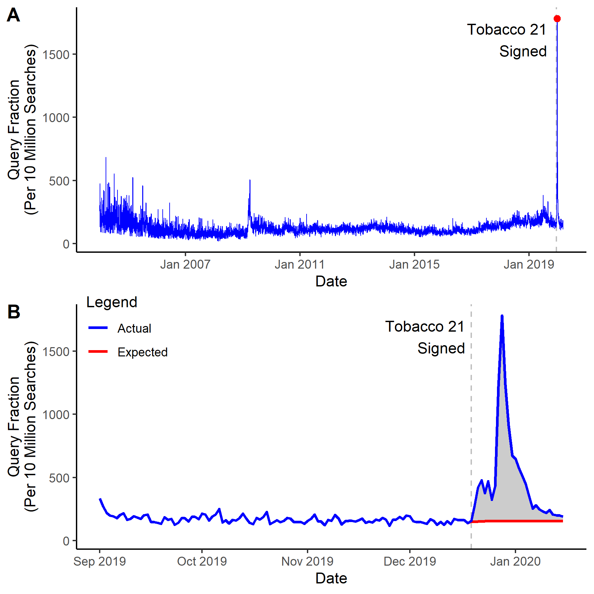

# gtrendR: An R Complement to the gtrend package for Python

## Using the Package

Before you begin using this package, pull the Google Trends data using the gtrends package for Python.

### Installing the package

```r

##Only run this once
library(devtools)
devtools::install_github("tlcaputi/gtrendR", force = T)

## Run this every time
library("gtrendR")

```

### ARIMA Spike with One Geography

First, use `run_arima` to create a dataset in the correct format for other functions.

```r
df <- run_arima(
  df = data,
  interrupt = ymd("2019-12-19"),
  geo = "US"
)

```

Now, you're ready to produce a few interesting figures. The first figure is a simple line plot.


```r
panA <- line_plot(
  df,
  beginplot = T,
  endplot = T,
  interrupt = ymd("2019-12-19")
  linelabel = "Interruption",
  title = NULL,
  xlab = "Date",
  ylab = "Query Fraction\n(Per 10 Million Searches)",
  lbreak = "1 year",
  lwd = 0.3,
  width = 6,
  height = 3,
  save = T,
  outfn = './output/panA.png'
)
```

You can also produce a plot that highlights the difference between the ARIMA-expected and actual search volumes.

```r
panB <- arima_plot(
  df,
  title = "Searches to Purchase Cigarettes - US",
  xlab = "Date",
  ylab = "Query Fraction",
  outfn = './output/fig.pdf',
  beginplot = "2019-09-01",
  endplot = "2020-01-15",
  lbreak = "1 year",
  linelabel = "Tobacco 21\nSigned",
  interrupt = ymd("2019-12-19"),
  width = 6,
  height = 3,
  lwd = 0.3,
  save = T
)

```

Finally, you can merge the plots together to create a single figure.

```r
fig <- plot_grid(panA, panB, labels=c(LETTERS[1:2]), ncol=1, nrow=2, rel_heights=c(1,1))
save_plot("./output/Fig1.png", fig, base_width=6, base_height=6)

```




### ARIMA Spike with Multiple Geographies

If you are interested in visualising changes by US state, you may want to create a figure showing the percentage change before versus after the interruption.


```r

panC <- line_plot(
  df = finaldf,
  geo = "US",
  title = NULL,
  xlab = "Date",
  ylab = "Query Fraction\n(Per 10 Million Searches)",
  beginplot = "2019-09-01",
  endplot = "2020-01-15",
  interrupt = ymd("2019-12-20"),
  lbreak = "1 month",
  lwd = 1,
  save = T
  width = 6,
  height = 3,
  outfn = './output/panA.png',
)

```


To show how states differ from their individual ARIMA estimates, start with `state_arima`.

```r
state_df <- state_arima(
  data = read.csv("./temp/data.csv", header = T, stringsAsFactor = F),
  interrupt = "2019-03-01"
)
```


Using the output from this, you can create a spaghetti plot showing the percent difference between the ARIMA-fitted values and the actual values.


```r
panD <- state_arima_spaghetti(
  state_df,
  interrupt = "2019-03-01",
  title = NULL,
  xlab = "Date",
  ylab = "Actual Versus Model-Fitted\nSearch Queries (% Diff.)",
  data = read.csv("./temp/data.csv", header = T, stringsAsFactor = F),
  linelabel = "COVID-19\nOutbreak",
  lbreak = "1 week",
  lwd = 0.4,
  beginplot = ymd("2019-03-01")-(7*1),
  endplot = ymd("2019-03-18"),
  xfmt = date_format("%d %b"),
  states_with_labels = c("CA", "NY", "US", "IA"),
  states_to_exclude = c("IA"),
  save = T,
  width = 6,
  height = 4,
  outfn = "./output/panB.png"
)
```


You can also visualize the state-specific differences between ARIMA-fitted values and actual values using `state_arima_pctdiff`.

```r
panE <- state_arima_pctdiff(
  state_df,
  outfn = "./output/panC.png"
)
```

Finally, combine the plots.


```r
fig <- plot_grid(panC, panD, panE, labels=c(LETTERS[3:5]), ncol=1, nrow=3, rel_heights=c(1.1, 1, 1.1))
save_plot("./output/Fig2.png", fig, base_width=6, base_height=9)
```
