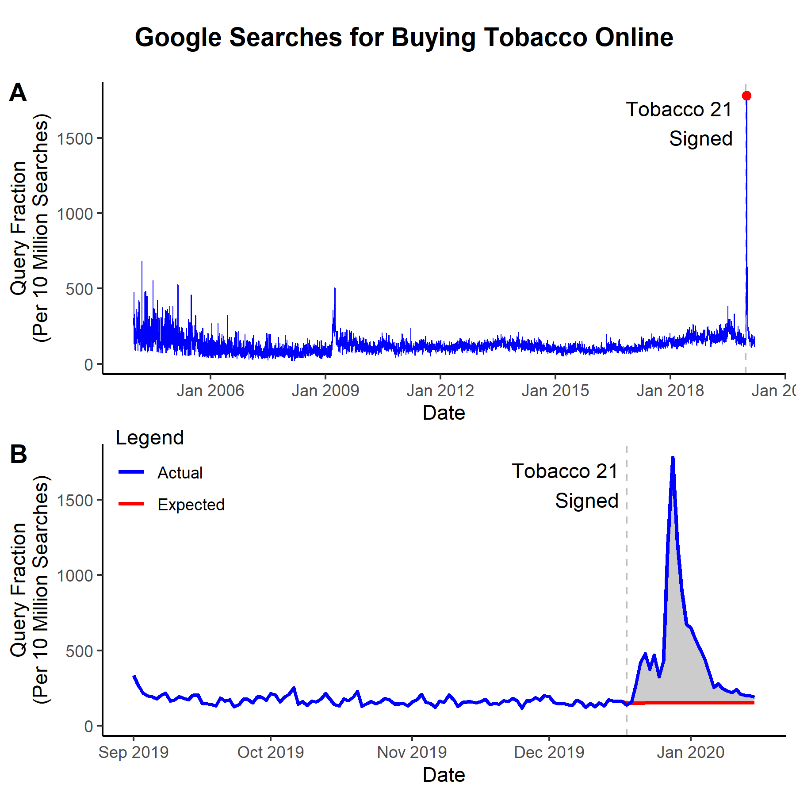
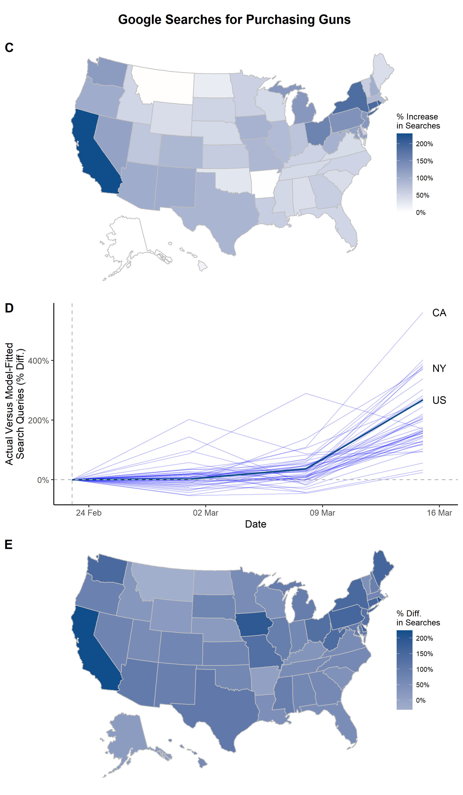

# gtrendR: An R Complement to the gtrend package for Python

## Using the Package

Before you begin using this package, pull the Google Trends data using the gtrends package for Python.

If you do not wish to use the gtrends package for Python, you'll need to format your data in the following format and save it as a CSV:

|timestamp |US         |US_AL      |US_CA      |US_NY      |
|----------|-----------|-----------|-----------|-----------|
|2020-01-02|642.8568888|636.164136 |262.0138526|991.5688604|
|2020-01-03|969.2211805|696.3971518|578.4875232|248.9556789|
|2020-01-04|232.1583943|655.6860359|189.5345507|279.1872892|
|2020-01-05|488.0699387|471.8936588|953.0010047|131.028145 |
|2020-01-06|758.2366717|997.2484335|740.3822249|558.1017193|
|2020-01-07|443.525007 |211.6926334|358.489257 |240.2757544|
|2020-01-08|947.7052461|664.2961719|346.3216015|907.9927533|
|2020-01-09|415.2533228|448.5096531|222.1345994|333.3310304|
|2020-01-10|919.4877736|254.382975 |811.7631744|134.159574 |

Notice that the column with dates is titled "timestamp" and all other column names correspond to geographies. For example, the search value for the US on 2020-01-02 is 642.9. The search value for Alabama (US_AL) is 636.2.

(NOTE: These are randomly generated values that do not correspond to actual search volumes for anything.)

### Installing the package

```r

# Only run this once
library(devtools)
devtools::install_github("tlcaputi/gtrendR", force = T)

# Run this every time
library("gtrendR")

```

### ARIMA Spike with One Geography

First, use `run_arima` to create a dataset in the correct format for other functions.

```r
US_df <- run_arima(
  df = read.csv("./output/data.csv", header = T, stringsAsFactor = F),
  interrupt = "2019-12-19",
  geo = "US"
)
```

Now, you're ready to produce a few interesting figures. The first figure is a simple line plot.


```r
panA <- line_plot(
  US_df,
  beginplot = T,
  endplot = T,
  interrupt = "2019-12-19",
  linelabel = "Tobacco 21\nSigned",
  title = NULL,
  xlab = "Date",
  ylab = "Query Fraction\n(Per 10 Million Searches)",
  lbreak = "3 year",
  lwd = 0.3,
  save = T,
  height = 3,
  width = 6,
  outfn = './output/panA.png'
)
```

You can also produce a plot that highlights the difference between the ARIMA-expected and actual search volumes.

```r
panB <- arima_plot(
  US_df,
  title = NULL,
  xlab = "Date",
  ylab = "Query Fraction",
  beginplot = "2019-09-01",
  endplot = "2020-01-15",
  lbreak = "1 month",
  linelabel = "Tobacco 21\nSigned",
  interrupt = ymd("2019-12-19"),
  lwd = 1,
  save = T,
  width = 6,
  height = 3,
  outfn = './output/panB.pdf'
)
```

Finally, you can merge the plots together to create a single figure.

```r
title <- ggdraw() +
  draw_label(
    "Google Searches for Buying Tobacco Online",
    fontface = 'bold',
    hjust = 0.5
  ) +
  theme(
    plot.margin = margin(0, 0, 0, 7)
  )

fig <- plot_grid(panA, panB, labels=c(LETTERS[1:2]), ncol=1, nrow=2, rel_heights=c(1,1))
fig <- plot_grid(title, fig, ncol = 1, rel_heights = c(0.1, 1))
save_plot("./output/Fig1.png", fig, base_width=6, base_height=6)
```

<!--  -->


### ARIMA Spike with Multiple Geographies

If you are interested in visualising changes by US state, you may want to create a figure showing the percentage change before versus after the interruption using `state_pct_change`.


```r
panC <- state_pct_change(
  df = read.csv("./temp/data.csv", header = T, stringsAsFactor = F),
  interrupt = "2020-03-01",
  beginperiod = NA,
  preperiod = 90,
  endperiod = "2020-03-23",
  scaletitle = "% Increase\nin Searches",
  linecol = "gray",
  lowcol = "red",
  midcol = "white",
  highcol = "dodgerblue4",
  save = T,
  width = 6,
  height = 3,
  outfn = './output/panC.pdf'
)
```


To show how states differ from their individual ARIMA estimates, start with `state_arima`.

```r
state_list <- state_arima(
  data = read.csv("./temp/data.csv", header = T, stringsAsFactor = F),
  interrupt = "2020-03-01"
)
```


Using the output from this, you can create a spaghetti plot showing the percent difference between the ARIMA-fitted values and the actual values with `state_arima_spaghetti`.


```r
panD <- state_arima_spaghetti(
  state_list,
  interrupt = "2020-03-01",
  title = NULL,
  xlab = "Date",
  ylab = "Actual Versus Model-Fitted\nSearch Queries (% Diff.)",
  linelabel = "COVID-19\nOutbreak",
  lbreak = "1 week",
  lwd = 0.4,
  beginplot = ymd("2020-03-01")-(7*1),
  endplot = ymd("2020-03-16"),
  xfmt = date_format("%d %b"),
  states_with_labels = c("CA", "NY", "US"),
  states_to_exclude = c("IA"),
  save = T,
  width = 6,
  height = 4,
  outfn = "./output/panD.png"
)
```


You can also visualize the state-specific differences between ARIMA-fitted values and actual values using `state_arima_pctdiff`.

```r
panE <- state_arima_pctdiff(
  state_list,
  save = T,
  width = 6,
  height = 3,
  outfn = './output/panE.pdf'
)
```

Finally, combine the plots.


```r
title <- ggdraw() +
  draw_label(
    "Google Searches for Purchasing Guns",
    fontface = 'bold',
    hjust = 0.5
  ) +
  theme(
    plot.margin = margin(0, 0, 0, 7)
  )
fig <- plot_grid(panC, panD, panE, labels=c(LETTERS[3:5]), ncol=1, nrow=3, rel_heights=c(1.1, 1, 1.1))
fig <- plot_grid(title, fig, ncol = 1, rel_heights = c(0.05, 1))
save_plot("./output/Fig2.png", fig, base_width=7, base_height=12)
```

<!--  -->
