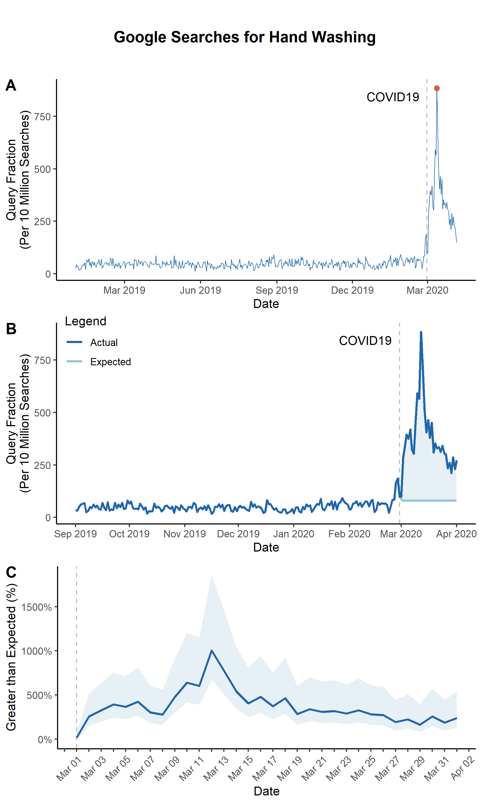

# gtrendR: An R Complement to the gtrend package for Python

## Disclaimer
This project is a work-in-progress. It works in some cases but may not work in many others (and may not be flexible enough for some users), and some extra code exists for functions that are not yet operational. Most things are not properly documented, and you may need to refer to the source code. This program has only been tested in Windows 10.


## Usage

Before you begin using this package, pull the Google Trends data using the [gtrendspy package for Python3](https://www.github.com/tlcaputi/gtrendspy). For example, we will use the following data pull to demonstrate the features of the package. Unfortunately, I cannot share the raw data.

```python

from gtrendspy import timeline

timeline.theo_timeline(
    terms = ['hand washing', 'social isolation'],
    names = ['handwashing', 'socialisolation'],
    start = '2019-01-01',
    end = '2020-06-01',
    timeframe_list = ['day'],
    geo_country_list = ['US'],
    us_states = True,
    worldwide = False,
    timestep_years = 1,
    batch_size = 2,
    outpath = "/path/to/ROOTPATH/input",
    creds = "/path/to/info.py"
)
```

To use the [gtrendspy package for Python3](https://www.github.com/tlcaputi/gtrendspy), you'll need to request an API Key from Google. You can do that easily [here](https://docs.google.com/forms/d/e/1FAIpQLSenHdGiGl1YF-7rVDDmmulN8R-ra9MnGLLs7gIIaAX9VHPdPg/viewform). If you do not wish to use the gtrends package for Python, you'll need to format your data to match the following and save it as a CSV:

|timestamp |US         |US_AL      |US_CA      |US_NY      |
|----------|-----------|-----------|-----------|-----------|
|2020-01-02|642.8568888|636.164136 |262.0138526|991.5688604|
|2020-01-03|969.2211805|696.3971518|578.4875232|248.9556789|
|2020-01-04|232.1583943|655.6860359|189.5345507|279.1872892|
|2020-01-05|488.0699387|471.8936588|953.0010047|131.028145 |
|2020-01-06|758.2366717|997.2484335|740.3822249|558.1017193|
|2020-01-07|443.525007 |211.6926334|358.489257 |240.2757544|
|2020-01-08|947.7052461|664.2961719|346.3216015|907.9927533|
|2020-01-09|415.2533228|448.5096531|222.1345994|333.3310304|
|2020-01-10|919.4877736|254.382975 |811.7631744|134.159574 |

Notice that the column with dates is titled "timestamp" and all other column names correspond to geographies. For example, the search value for the US on 2020-01-02 is 642.9. The search value for the same date for Alabama (US_AL) is 636.2.

(NOTE: These are randomly generated values that do not correspond to actual search volumes for anything.)

### Installing the package

```r
# Only run this once
library(devtools)
devtools::install_github("tlcaputi/gtrendR", force = T)

# Run this every time
library("gtrendR")
```

### ARIMA Spike with One Geography

First, use `run_arima` to create a dataset in the correct format for other functions.

```r
US_df <- run_arima(
  df = read.csv("./input/handwashing_day.csv", header = T, stringsAsFactor = F), # Data from gtrends
  interrupt = "2020-03-01", # Interruption point in your data
  geo = "US", # geography you want to use
  kalman = T # If True, uses Kalman method to impute time series
)
```

Now, you're ready to produce a few interesting figures. The first figure is a simple line plot.


```r
panA <- line_plot(
  US_df, # data from run_arima
  geo = 'US', # geography you wnat to use

  ## Create a vertical "interruption" line in your plot
  interrupt = "2020-03-01", # Date of an interruption
  linelabel = "COVID19",

  ## Plot arguments
  beginplot = T, # Start date for the plot. If T, beginning of data
  endplot = T, # End date for the plot. If T, end of data
  title = NULL, # If NULL, no Title
  xlab = "Date", # x axis label
  lbreak = "3 year", # Space between x-axis tick marks
  xfmt = date_format("%Y"), # Format of dates on x axis
  ylab = "Query Fraction (Per 10 Million Searches)", # y axis label
  lwd = 0.3, # Width of the line

  ## Set a colorscheme
  colorscheme = "blue",  # Color schemes set in this package "red", 'blue" or "jamaim"

  # ... customize any color using these
  hicol = NA, # Searches line color
  opcol = NA, # Color of point on top of spike


  ## Saving arguments
  save = T, # If T, save plot
  outfn = './output/panA.png', # Location to save plot
  width = 6, # Width in inches
  height = 3 # Height in inches
)
```

You can also produce a plot that highlights the difference between the ARIMA-expected and actual search volumes.

```r
panB <- arima_plot(
  US_df, ## data from run_arima

  ## Create a vertical "interruption" line in your plot
  interrupt = "2020-03-01", # Date of an interruption
  linelabel = "COVID19",
  linelabelpos = 0.02, # Where the label goes near the interruption line

  ## Plot Arguments
  beginplot = "2019-09-01", # Start date for the plot. If T, beginning of data
  endplot = "2020-04-01", # End date for the plot. If T, end of data
  title = NULL, # If NULL, no Title
  xlab = "Date", # x axis label
  lbreak = "1 month", # Space between x-axis tick marks
  xfmt = date_format("%b %Y"), # Format of dates on x axis
  ylab = "Query Fraction (Per 10 Million Searches)", # y axis label
  lwd = 1, # Width of the line

  ## Set a colorscheme
  colorscheme = "blue",  # Color schemes set in this package "red", 'blue" or "jamaim"

  # ... customize any color using these
  hicol = NA, # Actual line color
  locol = NA, # Expected line color
  nucol = NA, # Excess polygon color


  ## Saving arguments
  save = T, # If T, save plot
  outfn = './output/panB.png', # Location to save plot
  width = 6, # Width in inches
  height = 3 # Height in inches

)
```


We can also plot the difference between the actual and ARIMA-fitted values with the ARIMA 95% confidence interval


```r
panC <- arima_ciplot(
  US_df, ## data from run_arima

  ## Create a vertical "interruption" line in your plot
  interrupt = "2020-03-01", # Date of an interruption

  ## Plot Arguments
  beginplot = T, # Start date for the plot. If T, beginning of data
  endplot = "2020-04-01", # End date for the plot. If T, end of data
  title = NULL, # If NULL, no Title
  xlab = "Date", # x axis label
  lbreak = "1 week", # Space between x-axis tick marks
  xfmt = date_format("%b %Y"), # Format of dates on x axis
  ylab = "Greater than Expected (%)", # y axis label
  lwd = 1, # Width of the line

  ## Set a colorscheme
  colorscheme = "blue",  # Color schemes set in this package "red", 'blue" or "jamaim"

  # ... customize any color using these
  hicol = NA, # Actual line color
  locol = NA, # Expected line color
  nucol = NA, # Excess polygon color


  ## Saving arguments
  save = T, # If T, save plot
  outfn = './output/panC.png', # Location to save plot
  width = 6, # Width in inches
  height = 3 # Height in inches

)
```


Note that because the outputs from these functions are ggplots, you can use ggplot functions to customize them even after they are outputted.

```r
panC <- panC +
  scale_x_date(
    limits = c(ymd("2020-03-01"), ymd("2020-04-01")),
    date_breaks = "1 day",
    labels = function(x) ifelse(as.numeric(x) %% 2 != 0, "", format(x, format = "%b %d"))
  ) +
  theme(axis.text.x = element_text(angle = 45, vjust = 1.0, hjust = 1.0))
```


Finally, you can merge the plots together to create a single figure.

```r
## This adds a title to the plot
title <- ggdraw() +
  draw_label(
    "Google Searches",
    fontface = 'bold',
    hjust = 0.5
  ) +
  theme(
    plot.margin = margin(0, 0, 0, 7)
  )

fig <- plot_grid(panA, panB, panC, labels=c(LETTERS[1:3]), ncol=1, nrow=2, rel_heights=c(1,1))
fig <- plot_grid(title, fig, ncol = 1, rel_heights = c(0.1, 1))
save_plot("./output/Fig1.png", fig, base_width=6, base_height=10)
```



### Getting Raw or Absolute Counts of Searches using Comscore

You may be interested in calculating an estimate of the raw count of searches executed since your interruption or as estimate for the raw count of "excess" searches (searches above what you would expect if your interruption didn't occur). For this, we use `get_rawcounts` -- but PLEASE read the following explanation before you use it.

This function uses the estimates of monthly Desktop search volumes from [Comscore](https://www.comscore.com/Insights/Rankings?cs_edgescape_cc=US#tab_search_query/) to extrapolate the count of volumes for your searches. This process is [standard in the literature using Google search trends](https://jamanetwork.com/journals/jamainternalmedicine/fullarticle/2719193) but deserves some explanation. At any given time, Comscore provides estimates for the total volume of Desktop-based (i.e., not mobile) Google searches for the United States for two somewhat recent months. For example, as of April 10, 2020, they have estimates for January 2020 and February 2020. The function actively pulls these numbers from Comscore's website, so they will always be the two most current months available from Comscore. Still, Comscore gives us very limited information. We have to make several assumptions to calculate raw counts.

1. We first make an assumption as to which of those is most correct for your analysis. If you set `month` to 1, it will take the volume estimate for the earlier month. If you leave `month` as the default (2), it will take volume estimate for the later month. We assume that the raw count of Desktop Google searches is unchanging among months in your dataset.
2.    Next, we need to assume how these Desktop Google searches are distributed within months. The function assumes that the searches are distributed uniformly, i.e., each day or week has the same number of searches. If the Comscore month is in your dataset, the function figures out how many observations were in that month, divides the raw count by that number, and sets the result as the raw count of Desktop searches for every observation. If the Comscore month is not in your dataset, the function divides the raw count by 30 and multiplies it by the minimum number of days between any two observations in your dataset. For example, if it daily data, it divides the raw count by 30 and multiplies it by 1 to get daily Desktop Google search count.
3.       Then, we have to make an assumption about the percentage of all Google searches that are executed on Desktops. You can set this parameter through `pct_desktop`. We use this number to back out the total number of Google searches (i.e., desktop and mobile). If there is 100 Desktop Google Searches, and you expect 35\% of Google searches to be Desktop searches, then the total number of Google searches is 100/0.35 = 285.

This function prints the raw counts (the actual number of searches for your keywords, the expected number of searches, and the excess number of searches) between your `interrupt` and `endperiod`, as well as several of the assumptions from above. It also returns a data.frame that contains the raw search counts for each observation in the input data. I highly recommend you check the output data to ensure that the assumptions are reasonable.

```r

rawcounts_data <- get_rawcounts(
  df = US_df, # data from run_arima

  ## Analysis arguments
  interrupt = "2020-03-01", # Beginning of period to calculate raw counts
  endperiod = T # Default T, estimates will be given until the last available date in the dataset
  geo = "US", # the geography you're interested in

  ## Comscore Arguments
  month = 2, # Default is 2
  pct_desktop = 0.35,

  ## Google Trends API Argument
  qf_denominator = 10000000, # Denominator of query fractions, should be 10M, do not change
)

```

The output looks like this:

```
[1] "Using Comscore estimates for Feb-2020: 11127 Million Searches"
[1] "Assuming 29 observations per month"
[1] "Actual Searches from 2020-03-01 to 2020-04-05: 1405660.54909038"
[1] "Expected Searches from 2020-03-01 to 2020-04-05: 316628.32025804"
[1] "Excess Searches from 2020-03-01 to 2020-04-05: 1089032.22883234"

```

This indicates that there were approximately 1.4 million searches for hand washing between March 1, 2020 and April 5, 2020, where approximately 300,000 were expected. Therefore, there were approximately 1.1 million excess searches for hand washing in this period.

### ARIMA Spike with Multiple Geographies

If you are interested in visualising changes by US state, you may want to create a figure showing the percentage change before versus after the interruption using `state_pct_change`.


```r
out <- state_pct_change(
  df = read.csv("./input/handwashing_day.csv", header = T, stringsAsFactor = F), ## Data from gtrends

  ## You will need to decide on the timeframes for "before" and "after"
  beginperiod = NA, # If not NA, this is the start of the "before" period
  preperiod = 90, # If beginperiod is NA, this uses 90 days before the interruption
  interrupt = "2020-03-01", # The date of the interruption
  endperiod = "2020-04-01", # The after period is the interruption to the endperiod

  ## Scale Legend
  scaletitle = "% Increase\nin Searches",
  scalelimits = NULL, # Vector of length 2 with lower and upper limit

  ## Set a colorscheme
  colorscheme = "blue",  # Color schemes set in this package "red", 'blue" or "jamaim"

  # ... customize any color using these
  highcol = NA, # Color for highest percent change
  midcol = NA, # Color for 0 percent change
  lowcol = NA, # Color for lowest percent change
  linecol = "gray", # Line between states

  ## Saving arguments
  save = T, # If T, save plot
  outfn = './output/panD.png', # Location to save plot
  width = 6, # Width in inches
  height = 3, # Height in inches

  ## Get data back from this function
  return_df = T,
  # If this is True...
  bootstrap = T, ## Bootstrap confidence intervals for pct change
  bootnum = 1000, # Number of bootstraps
  alpha = 0.05 # Alpha value for CIs

)
```

If `return_df` is `T`, the data will be the first argument of the list and the plot will be the second argument of the list.

```{r}
panD <- out[[2]]
```


To show how states differ from their individual ARIMA estimates, start with `state_arima`. Note, this may take a while.

```r
state_list <- state_arima(
  data = read.csv("./input/handwashing_day.csv", header = T, stringsAsFactor = F), ## Data from gtrends
  interrupt = "2020-03-01", ## Interruption point
  begin = T, ## Beginning of the time period to use
  end = T, ## End of the time period to use
  kalman = T ## If True, Kalman impute NAs in the time series
)
```


Using the output from `state_arima`, you can create a spaghetti plot showing the percent difference between the ARIMA-fitted values and the actual values with `state_arima_spaghetti`. It doesn't look too great for this example (likely because "hand washing" was a rare search term before COVID19), but this kind of plot could be useful for other search terms.


```r
panE <- state_arima_spaghetti(
  state_list, # data from state_arima
  interrupt = "2020-03-01", # should be the same as state_arima

  ## Plot Arguments
  beginplot = "2020-03-01", # Start date for the plot. If T, beginning of data
  endplot = "2020-04-03", # End date for the plot. If T, end of data
  title = NULL, # If NULL, no Title
  xlab = "Date", # x axis label
  lbreak = "1 week", # Space between x-axis tick marks
  xfmt = date_format("%b-%d"), # Format of dates on x axis
  ylab = "Query Fraction\n(Per 10 Million Searches)", # y axis label
  lwd = 1, # Width of the line
  ylim = c(NA, NA), # y axis limts

  ## Spaghetti specific adjustments
  spaghettialpha = 0.25, # How transparent do you want the spaghetti lines
  states_with_labels = c("US"), ## Add labels to the end of these
  states_to_exclude = c("IA"), ## Don't include these

  ## Set a colorscheme
  colorscheme = "blue",  # Color schemes set in this package "red", 'blue" or "jamaim"

  # ... customize any color using these
  hicol = NA, # Color of US line
  locol = NA, # Color of other lines

  ## Saving arguments
  save = T, # If T, save plot
  outfn = './output/panE.png', # Location to save plot
  width = 6, # Width in inches
  height = 3 # Height in inches
)

panE <- panE + coord_cartesian(ylim = c(-10, 40))

```


You can also visualize the state-specific differences between ARIMA-fitted values and actual values using `state_arima_pctdiff`.

```r
panF <- state_arima_pctdiff(
  state_list, # data from state_arima

  ## Set a colorscheme
  colorscheme = "blue",  # Color schemes set in this package "red", 'blue" or "jamaim"

  # ... customize any color using these
  highcol = NA, # Color for highest percent change
  midcol = NA, # Color for 0 percent change
  lowcol = NA, # Color for lowest percent change
  linecol = "gray", # Line between states

  ## Scale Arguments
  scaletitle = "% Diff.\nin Searches",

  ## Saving arguments
  save = T, # If T, save plot
  outfn = './output/panE.png', # Location to save plot
  width = 6, # Width in inches
  height = 3 # Height in inches

)
```

Finally, combine the plots.


```r

## This creates a title
title <- ggdraw() +
  draw_label(
    "Google Searches",
    fontface = 'bold',
    hjust = 0.5
  ) +
  theme(
    plot.margin = margin(0, 0, 0, 7)
  )
fig <- plot_grid(panD, panE, panF, labels=c(LETTERS[4:6]), ncol=1, nrow=3, rel_heights=c(1.1, 1, 1.1))
fig <- plot_grid(title, fig, ncol = 1, rel_heights = c(0.05, 1))
save_plot("./output/Fig2.png", fig, base_width=7, base_height=12)
```


### ARIMA Spike with One Geography but Multiple Terms


We may want to explore the difference between the ARIMA-forecasted and actual values for several terms. In that case, we start with `multi_term_arima`


```r
multiterms <- multi_term_arima(

  ## A folder containing all of your gtrends data and ONLY your gtrends data
  input_dir = "./input",

  ## Which data to use
  geo = "US", # Geography you want to use
  terms_to_use = NA, # Terms you'd like to analyze. If NA then all terms
  timeframe_to_use = NA, # Only analyze data with filenames that contain a certain timeframe. If NA then all timeframes


  ## Parameters of time periods
  beginperiod = T, # Beginning of the before period, if T then beginning of data
  preperiod = 90, # If beginperiod is logical, preperiod is the number of days before interrupt to include in before period
  endperiod = T, # End of the end period, if T then end of data
  interrupt = "2020-03-01", # Date for interruption, splitting before and after periods


  ## Analytical arguments
  bootstrap = T, # Bootstrap CIs
  bootnum = 1000, # Number of bootstraps
  kalman = T # If T, impute with Kalman
)
```


Using this data, we can create a barplot using `multiterm_barplot`


```r
panG <- multiterm_barplot(
  df = multiterms %>% arrange(pctdiff),

  ## Graphing Parameters
  title = NULL, # If NULL, no Title
  xlab = "Terms", # x axis label
  label_df = NA, # Use a two-column dataframe to label the barplot x axis
  ylab = "Greater than Expected (%)", # y axis label
  space = 0.8, # space between bars

  ## Set a colorscheme
  colorscheme = "blue",  # Color schemes set in this package "red", 'blue" or "jamaim"

  # ... customize any color using these
  hicol = NA, # Color of bars

  ## Saving arguments
  save = T, # If T, save plot
  outfn = './output/panG.png', # Location to save plot
  width = 6, # Width in inches
  height = 3 # Height in inches
  )
```


