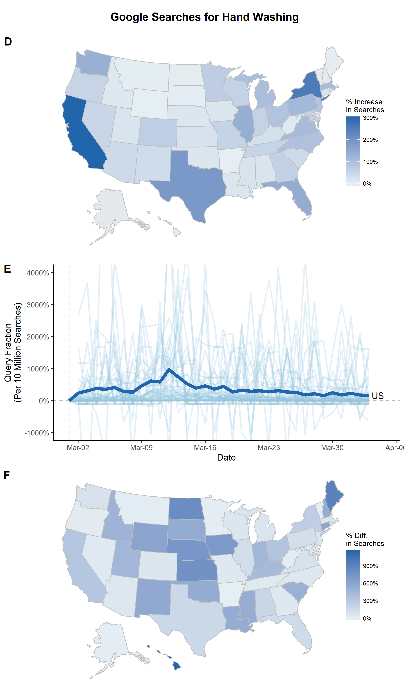

## ARIMA Spike with Multiple Geographies

If you are interested in visualising changes by US state, you may want to create a figure showing the percentage change before versus after the interruption using `state_pct_change`.


### state_pct_change
```r
out <- state_pct_change(
  df = read.csv("./input/handwashing_day.csv", header = T, stringsAsFactor = F), ## Data from gtrends

  ## You will need to decide on the timeframes for "before" and "after"
  beginperiod = NA, # If not NA, this is the start of the "before" period
  preperiod = 90, # If beginperiod is NA, this uses 90 days before the interruption
  interrupt = "2020-03-01", # The date of the interruption
  endperiod = "2020-04-01", # The after period is the interruption to the endperiod

  ## Scale Legend
  scaletitle = "% Increase\nin Searches",
  scalelimits = NULL, # Vector of length 2 with lower and upper limit

  ## Set a colorscheme
  colorscheme = "blue",  # Color schemes set in this package "red", 'blue" or "jamaim"

  # ... customize any color using these
  highcol = NA, # Color for highest percent change
  midcol = NA, # Color for 0 percent change
  lowcol = NA, # Color for lowest percent change
  linecol = "gray", # Line between states

  ## Saving arguments
  save = T, # If T, save plot
  outfn = './output/panD.png', # Location to save plot
  width = 6, # Width in inches
  height = 3, # Height in inches

  ## Get data back from this function
  return_df = T,
  # If this is True...
  bootstrap = T, ## Bootstrap confidence intervals for pct change
  bootnum = 1000, # Number of bootstraps
  alpha = 0.05 # Alpha value for CIs

)
```

If `return_df` is `T`, the data will be the first argument of the list and the plot will be the second argument of the list.

```{r}
panD <- out[[2]]
```


To show how states differ from their individual ARIMA estimates, start with `state_arima`. Note, this may take a while.

### state_arima
```r
state_list <- state_arima(
  data = read.csv("./input/handwashing_day.csv", header = T, stringsAsFactor = F), ## Data from gtrends
  interrupt = "2020-03-01", ## Interruption point
  begin = T, ## Beginning of the time period to use
  end = T, ## End of the time period to use
  kalman = T ## If True, Kalman impute NAs in the time series
)
```


Using the output from `state_arima`, you can create a spaghetti plot showing the percent difference between the ARIMA-fitted values and the actual values with `state_arima_spaghetti`. It doesn't look too great for this example (likely because "hand washing" was a rare search term before COVID19), but this kind of plot could be useful for other search terms.

### state_arima_spaghetti
```r
panE <- state_arima_spaghetti(
  state_list, # data from state_arima
  interrupt = "2020-03-01", # should be the same as state_arima

  ## Plot Arguments
  beginplot = "2020-03-01", # Start date for the plot. If T, beginning of data
  endplot = "2020-04-03", # End date for the plot. If T, end of data
  title = NULL, # If NULL, no Title
  xlab = "Date", # x axis label
  lbreak = "1 week", # Space between x-axis tick marks
  xfmt = date_format("%b-%d"), # Format of dates on x axis
  ylab = "Query Fraction\n(Per 10 Million Searches)", # y axis label
  lwd = 1, # Width of the line
  ylim = c(NA, NA), # y axis limts

  ## Spaghetti specific adjustments
  spaghettialpha = 0.25, # How transparent do you want the spaghetti lines
  states_with_labels = c("US"), ## Add labels to the end of these
  states_to_exclude = c("IA"), ## Don't include these

  ## Set a colorscheme
  colorscheme = "blue",  # Color schemes set in this package "red", 'blue" or "jamaim"

  # ... customize any color using these
  hicol = NA, # Color of US line
  locol = NA, # Color of other lines

  ## Saving arguments
  save = T, # If T, save plot
  outfn = './output/panE.png', # Location to save plot
  width = 6, # Width in inches
  height = 3 # Height in inches
)

panE <- panE + coord_cartesian(ylim = c(-10, 40))

```


You can also visualize the state-specific differences between ARIMA-fitted values and actual values using `state_arima_pctdiff`.

### state_arima_pctdiff
```r
panF <- state_arima_pctdiff(
  state_list, # data from state_arima

  ## Set a colorscheme
  colorscheme = "blue",  # Color schemes set in this package "red", 'blue" or "jamaim"

  # ... customize any color using these
  highcol = NA, # Color for highest percent change
  midcol = NA, # Color for 0 percent change
  lowcol = NA, # Color for lowest percent change
  linecol = "gray", # Line between states

  ## Scale Arguments
  scaletitle = "% Diff.\nin Searches",

  ## Saving arguments
  save = T, # If T, save plot
  outfn = './output/panE.png', # Location to save plot
  width = 6, # Width in inches
  height = 3 # Height in inches

)
```

Finally, combine the plots.


```r
## This creates a title
title <- ggdraw() +
  draw_label(
    "Google Searches",
    fontface = 'bold',
    hjust = 0.5
  ) +
  theme(
    plot.margin = margin(0, 0, 0, 7)
  )
fig <- plot_grid(panD, panE, panF, labels=c(LETTERS[4:6]), ncol=1, nrow=3, rel_heights=c(1.1, 1, 1.1))
fig <- plot_grid(title, fig, ncol = 1, rel_heights = c(0.05, 1))
save_plot("./output/Fig2.png", fig, base_width=7, base_height=12)
```


