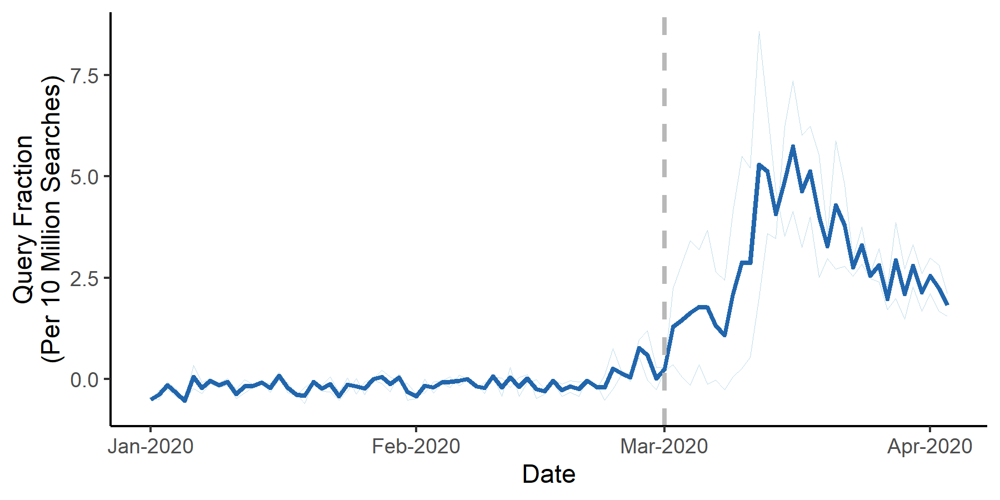

## ARIMA Spike with One Geography but Multiple Terms


We may want to explore the difference between the ARIMA-forecasted and actual values for several terms. In that case, we start with `multi_term_arima`

### multi_term_arima
```r
multiterms <- multi_term_arima(

  ## A folder containing all of your gtrends data and ONLY your gtrends data
  input_dir = "./input",

  ## Which data to use
  geo = "US", # Geography you want to use
  terms_to_use = NA, # Terms you'd like to analyze. If NA then all terms
  timeframe_to_use = NA, # Only analyze data with filenames that contain a certain timeframe. If NA then all timeframes


  ## Parameters of time periods
  beginperiod = T, # Beginning of the before period, if T then beginning of data
  preperiod = 90, # If beginperiod is logical, preperiod is the number of days before interrupt to include in before period
  endperiod = T, # End of the end period, if T then end of data
  interrupt = "2020-03-01", # Date for interruption, splitting before and after periods


  ## Analytical arguments
  bootstrap = T, # Bootstrap CIs
  bootnum = 1000, # Number of bootstraps
  kalman = T, # If T, impute with Kalman
  linear = F # If T, uses linear model rather than ARIMA.
)
```


Using this data, we can create a barplot using `multiterm_barplot`

### multiterm_barplot
```r
panG <- multiterm_barplot(
  df = multiterms %>% arrange(pctdiff),

  ## Graphing Parameters
  title = NULL, # If NULL, no Title
  xlab = "Terms", # x axis label
  label_df = NA, # Use a two-column dataframe to label the barplot x axis
  ylab = "Greater than Expected (%)", # y axis label
  space = 0.8, # space between bars

  ## Set a colorscheme
  colorscheme = "blue",  # Color schemes set in this package "red", 'blue" or "jamaim"

  # ... customize any color using these
  hicol = NA, # Color of bars

  ## Saving arguments
  save = T, # If T, save plot
  outfn = './output/panG.png', # Location to save plot
  width = 6, # Width in inches
  height = 3 # Height in inches
  )
```


We may want to make a spaghetti plot visualizing how several related terms have increased together. We can use `multiterm_spaghetti` to create a plot where the spaghetti is individual (related) terms and the mean is represented by a darker line. Here, we only have two terms -- this plot would look nicer with more terms.

### multiterm_spaghetti
```r

multiterm_spaghetti(
  multiterm_list = multiterms,
  interrupt = "2020-03-01",
  terms_to_use = NA,

  ## Plot Arguments
  beginplot = "2020-01-01", # Start date for the plot. If T, beginning of data
  endplot = "2020-04-03", # End date for the plot. If T, end of data
  title = NULL, # If NULL, no Title
  xlab = "Date", # x axis label
  lbreak = "1 week", # Space between x-axis tick marks
  xfmt = date_format("%b-%d"), # Format of dates on x axis
  ylab = "Query Fraction\n(Per 10 Million Searches)", # y axis label
  lwd = 1, # Width of the line
  ylim = c(NA, NA), # y axis limts

  ## Spaghetti specific adjustments
  spaghettialpha = 0.6, # How transparent do you want the spaghetti lines

  ## Set a colorscheme
  colorscheme = "blue",  # Color schemes set in this package "red", 'blue" or "jamaim"

  # ... customize any color using these
  hicol = NA, # Color of US line
  locol = NA, # Color of other lines

  ## Saving arguments
  save = T, # If T, save plot
  outfn = './output/panH.png', # Location to save plot
  width = 6, # Width in inches
  height = 3 # Height in inches
)
```


