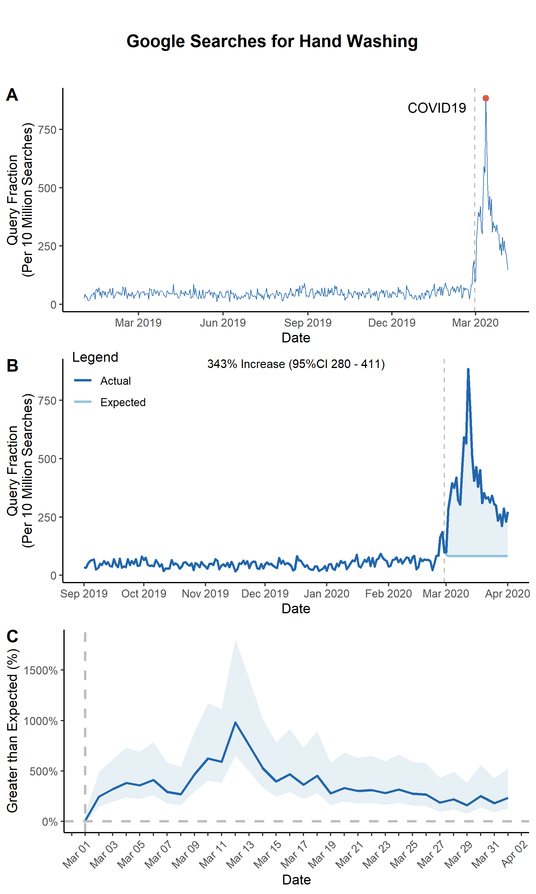

## ARIMA Spike with One Geography

First, use `run_arima` to create a dataset in the correct format for other functions.

### run_arima
```r
US_df <- run_arima(
  df = read.csv("./input/handwashing_day.csv", header = T, stringsAsFactor = F), # Data from gtrends
  interrupt = "2020-03-01", # Interruption point in your data
  geo = "US", # geography you want to use
  bootstrap = F, # bootstrap the confidence intervals
  linear = F, # Default F. If False, uses ARIMA. If True, uses a linear model.
  kalman = T # If True, uses Kalman method to impute time series

)
```

Now, you're ready to produce a few interesting figures. The first figure is a simple line plot.


### line_plot
```r
panA <- line_plot(
  US_df, # data from run_arima
  geo = 'US', # geography you wnat to use

  ## Create a vertical "interruption" line in your plot
  interrupt = "2020-03-01", # Date of an interruption
  linelabel = "COVID19",

  ## Plot arguments
  beginplot = T, # Start date for the plot. If T, beginning of data
  endplot = T, # End date for the plot. If T, end of data
  title = NULL, # If NULL, no Title
  xlab = "Date", # x axis label
  lbreak = "3 year", # Space between x-axis tick marks
  xfmt = date_format("%Y"), # Format of dates on x axis
  ylab = "Query Fraction (Per 10 Million Searches)", # y axis label
  lwd = 0.3, # Width of the line

  ## Set a colorscheme
  colorscheme = "blue",  # Color schemes set in this package "red", 'blue" or "jamaim"

  # ... customize any color using these
  hicol = NA, # Searches line color
  opcol = NA, # Color of point on top of spike


  ## Saving arguments
  save = T, # If T, save plot
  outfn = './output/panA.png', # Location to save plot
  width = 6, # Width in inches
  height = 3 # Height in inches
)
```

You can also produce a plot that highlights the difference between the ARIMA-expected and actual search volumes.

### arima_plot
```r
panB <- arima_plot(
  US_df, ## data from run_arima

  ## Create a vertical "interruption" line in your plot
  interrupt = "2020-03-01", # Date of an interruption
  linelabel = "COVID19",
  linelabelpos = 0.02, # Where the label goes near the interruption line


  ## Plot Arguments
  beginplot = "2019-09-01", # Start date for the plot. If T, beginning of data
  endplot = "2020-04-01", # End date for the plot. If T, end of data
  title = NULL, # If NULL, no Title
  xlab = "Date", # x axis label
  lbreak = "1 month", # Space between x-axis tick marks
  xfmt = date_format("%b %Y"), # Format of dates on x axis
  ylab = "Query Fraction (Per 10 Million Searches)", # y axis label
  lwd = 1, # Width of the line
  label = T, # put increase in searches in plot
  labsize = 0.8, # size of label

  ## Set a colorscheme
  colorscheme = "blue",  # Color schemes set in this package "red", 'blue" or "jamaim"

  # ... customize any color using these
  hicol = NA, # Actual line color
  locol = NA, # Expected line color
  nucol = NA, # Excess polygon color


  ## Saving arguments
  save = T, # If T, save plot
  outfn = './output/panB.png', # Location to save plot
  width = 6, # Width in inches
  height = 3 # Height in inches

)
```


We can also plot the difference between the actual and ARIMA-fitted values with the ARIMA 95% confidence interval


### arima_ciplot
```r
panC <- arima_ciplot(
  US_df, ## data from run_arima

  ## Create a vertical "interruption" line in your plot
  interrupt = "2020-03-01", # Date of an interruption

  ## Plot Arguments
  beginplot = T, # Start date for the plot. If T, beginning of data
  endplot = "2020-04-01", # End date for the plot. If T, end of data
  title = NULL, # If NULL, no Title
  xlab = "Date", # x axis label
  lbreak = "1 week", # Space between x-axis tick marks
  xfmt = date_format("%b %Y"), # Format of dates on x axis
  ylab = "Greater than Expected (%)", # y axis label
  lwd = 1, # Width of the line

  ## Set a colorscheme
  colorscheme = "blue",  # Color schemes set in this package "red", 'blue" or "jamaim"

  # ... customize any color using these
  hicol = NA, # Actual line color
  locol = NA, # Expected line color
  nucol = NA, # Excess polygon color


  ## Saving arguments
  save = T, # If T, save plot
  outfn = './output/panC.png', # Location to save plot
  width = 6, # Width in inches
  height = 3 # Height in inches

)
```


Note that because the outputs from these functions are ggplots, you can use ggplot functions to customize them even after they are outputted.

```r
panC <- panC +
  scale_x_date(
    limits = c(ymd("2020-03-01"), ymd("2020-04-01")),
    date_breaks = "1 day",
    labels = function(x) ifelse(as.numeric(x) %% 2 != 0, "", format(x, format = "%b %d"))
  ) +
  theme(axis.text.x = element_text(angle = 45, vjust = 1.0, hjust = 1.0))
```


Finally, you can merge the plots together to create a single figure.

```r
## This adds a title to the plot
title <- ggdraw() +
  draw_label(
    "Google Searches",
    fontface = 'bold',
    hjust = 0.5
  ) +
  theme(
    plot.margin = margin(0, 0, 0, 7)
  )

fig <- plot_grid(panA, panB, panC, labels=c(LETTERS[1:3]), ncol=1, nrow=2, rel_heights=c(1,1))
fig <- plot_grid(title, fig, ncol = 1, rel_heights = c(0.1, 1))
save_plot("./output/Fig1.png", fig, base_width=6, base_height=10)
```


