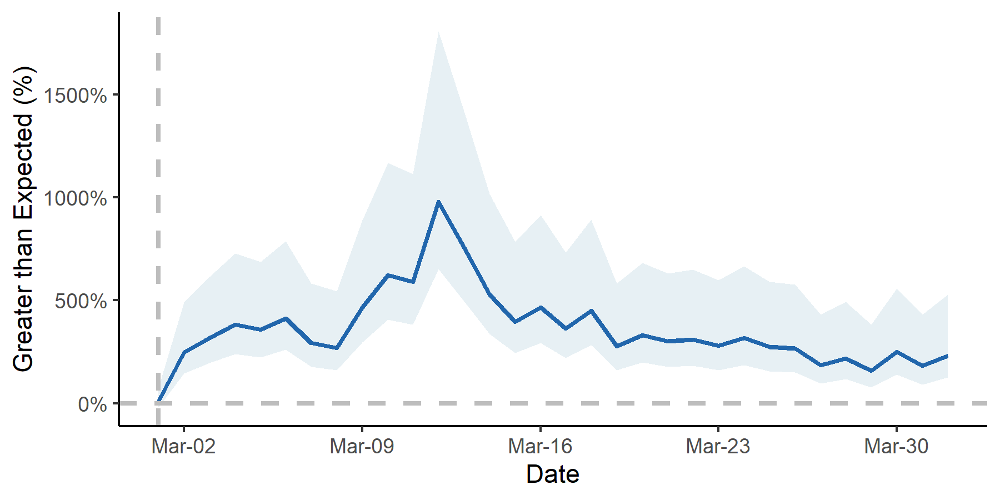

# gtrendR: Analyze and Visualize data from the Google Trends API with R

## Features

This package currently focuses on analyzing "spikes" (or other increases) in search volumes from Google Trends occurring after some known event ("interruption"). An increase in searches following an event may indicate that the event spurred increased public interest in a health topic or behavior. For example, past studies have used increases in searches following a given date to provide evidence that [Charlie Sheen's HIV announcement increased searches for HIV testing](https://jamanetwork.com/journals/jamainternalmedicine/fullarticle/2495274), that the [Netflix show "13 Reasons Why" increased searches for committing suicide](https://jamanetwork.com/journals/jamainternalmedicine/fullarticle/2646773), and that [the #MeToo movement increased searches for sexual harassment training](https://jamanetwork.com/journals/jamainternalmedicine/fullarticle/2719193). Now you can do the same sort of analyses with even beginner-level expertise in R! Specifically, this package allows users to:

- Perform ARIMA-based interrupted time series analysis
- Analyze and visualize the difference between actual and expected searches
- Compare search volumes before and after an interruption
- Conduct ARIMA analyses analyses over several states
- Compare search volume growth among several search terms
- Easily compute estimates of the absolute counts of Google searches using Comscore

## Navigating this Documentation

Be well on your way to publication-worthy results in just 10 minutes!

1. Set your file structure for your project. If you want to follow along with my examples, you should set it up like this:

```text
  root
  ├───code
  ├───input
  │   └───individual
  ├───output
  └───temp
```

2. Pull your data from Google Trends using [gtrendspy](/en/latest/gtrendspy).
3. Install the [gtrendR package for R](/en/latest/installation).
4. Decide what figure you want to make first by clicking on [one of the graphs below](/en/latest/#graph-gallery).
5. Follow the instructions on the page. Typically, there's an initial step to process your data into the correct format, and then you can skip to the function that generates the figure you want.
6. Repeat for as many functions as you'd like to create a nice "data dashboard"!

## Graph Gallery

Click on any of the following graph types to see how you can make one using your own data.

#### line_plot
[](/en/latest/arima-one-geo)

#### arima_plot
[](/en/latest/arima-one-geo)

#### arima_ciplot
[](/en/latest/arima-one-geo)

#### state_pct_change
[](/en/latest/arima-multi-geo)

#### state_arima_spaghetti
[](/en/latest/arima-multi-geo)

#### state_arima_pctdiff
[](/en/latest/arima-multi-geo)

#### multiterm_barplot
[](/en/latest/arima-multi-terms)

#### multiterm_spaghetti
[](/en/latest/arima-multi-terms)


## Disclaimer
This project is a work-in-progress. It works in some cases but may not work in many others (and may not be flexible enough for some users), and some extra code exists for functions that are not yet operational. Most things are not properly documented, and you may need to refer to the source code. This program has only been tested in Windows 10.


## Citation

If you find this package useful, please consider citing me in your work.

```text
Caputi TL. 2020. gtrendspy and gtrendR: Packages for analyzing Google Trends Data.
```

<!--
## Project layout

    docs/
        index.md  # The documentation homepage.
        gtrendspy.md   # Pull data from gtrendspy
        installation.md   # Install the gtrendR package
        armia-one-geo.md   # Analyze a spike in searches
        arima-multi-geo.md   # Compare several geographies
        arima-multi-terms.md   # Compare several terms
        absolute-counts.md   # Retrieve absolute counts of searches from Comscore -->
